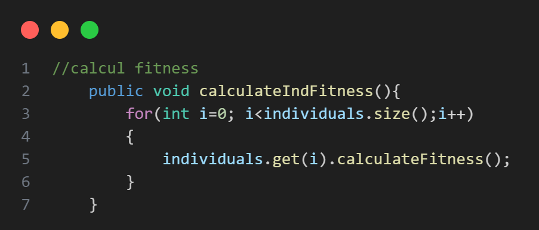
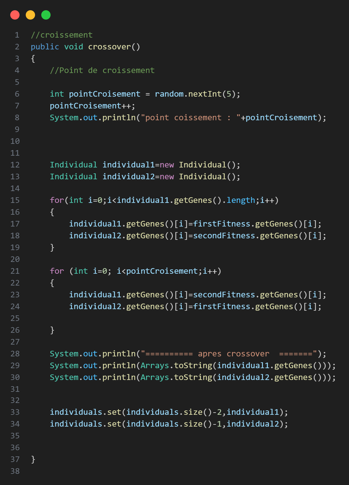
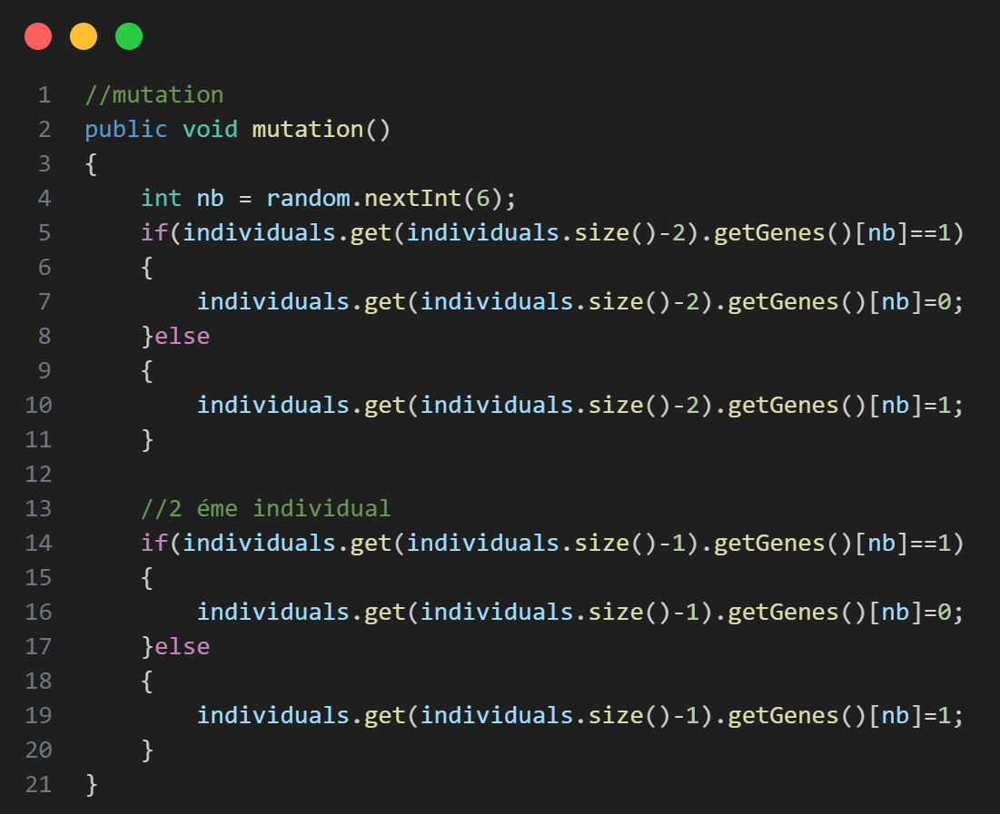
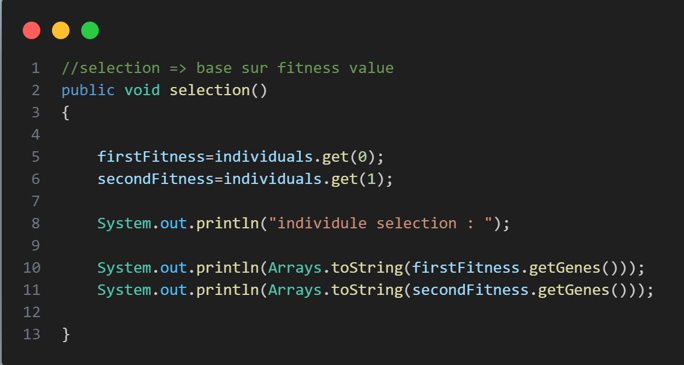
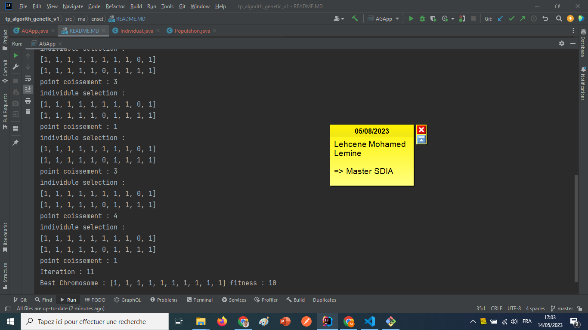

<h2>Implementation Algorithm Genertic</h2>
<h3>Les etaps de Algorithm Genetic</h3>

<h3>Les etapes Algorithms Genetic en plus details avec Exelmple pratique dans cet images</h3>

<h2>Exemple 1 : Implementation avec Algorithm Genetic pour trouver un chromosome qui  contient 1 seulement.</h2>

<h2>1-Initial Population</h2>

<h4>-Pour Créer un Individual</h4>

<h4>-fonction initializePopulation() : pour intilialiser liste des individuels</h4>

<h2>2-Fitness Function</h2>
<h4>-fonction calculateIndFitness() : fonction pour calculer la valeur de fitness pour chacun des individuals</h4>

<h2>3-Cross-over</h2>
<h4>-fonction pour faire etape crossover en les individuals selectionner.</h4>

<h2>4-Mutation</h2>
<h4>-fonction pour faire etape mutation.</h4>

<h2>5-Selection</h2>
<h4>- fonction pour selectionner les deux meilleurs chromsome par valeur de fitness.</h4>

<h3>Test Algorithm</h3>

