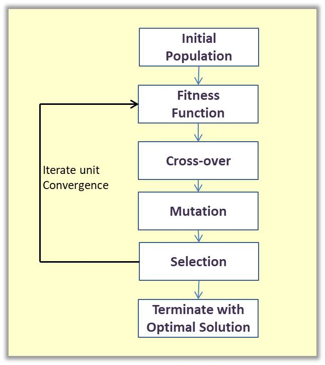
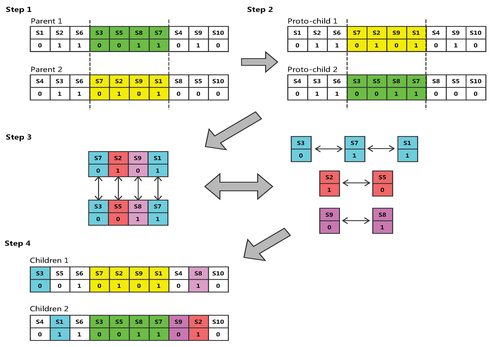

<h2>Implementation Algorithm Genertic</h2>
<h3>Les etaps de Algorithm Genetic</h3>

<h3>Les etapes Algorithms Genetic en plus details avec Exelmple pratique dans cet images</h3>

Implementation avec Algorithm Genetic pour trouver un chromosome qui  contient 1 seulement.

1-fonction initializePopulation() : pour intilialiser liste des individuels

public void initializePopulation(){
for(int i=0; i<20;i++)
{
individuals.add(new Individual());
}
}
