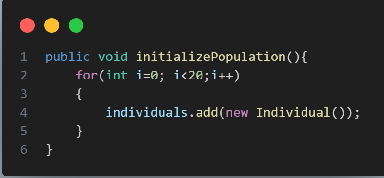

<h2>Implementation Algorithm Genertic</h2>
<h3>Les etaps de Algorithm Genetic</h3>

<h3>Les etapes Algorithms Genetic en plus details avec Exelmple pratique dans cet images</h3>

Implementation avec Algorithm Genetic pour trouver un chromosome qui  contient 1 seulement.

<h2>Initial Population</h2>

<h4>1-Pour Créer un Individual</h4>

<h4>2-fonction initializePopulation() : pour intilialiser liste des individuels</h4>

